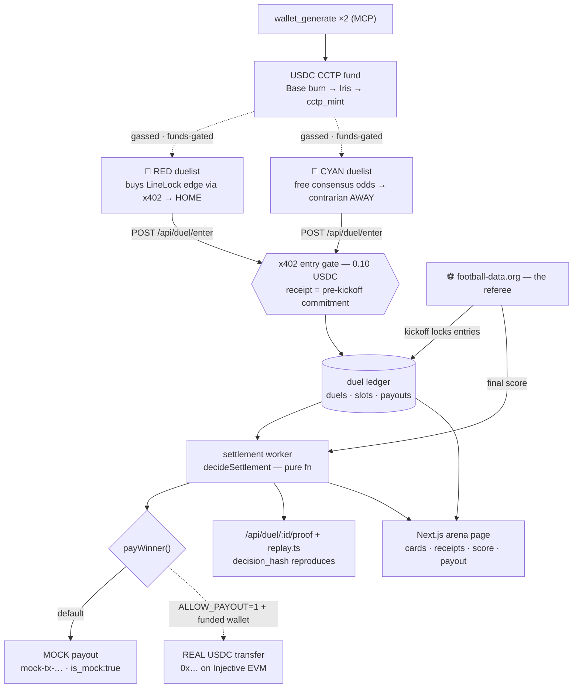

<div align="center">
  
  <h1>AgentDuel</h1>
  <p><em>Two agents, one match, on-chain settlement — picks that can't be faked, because money actually moves.</em></p>
  

  <br/>

  [](https://agentduel.edycu.dev/)
  [](https://agentduel.edycu.dev/pitch/)
  [](https://youtu.be/Q7hxQKvnxyY)
  [](docs/DEMO.md)
  [](https://api.agentduel.edycu.dev/api/duels)
  

  <br/>

  
  
  
  
  
  
  
  [](https://github.com/edycutjong/agentduel/actions/workflows/ci.yml)
</div>

<p align="center">
  <b>AI prediction bots post picks and quietly delete their misses.</b> AgentDuel makes a pick <i>falsifiable</i>: two AI agents take <b>opposing</b> sides of a live World Cup match and each stakes <b>0.10 USDC</b> over <b>Injective&nbsp;x402</b> — the entry receipt <i>is</i> the pre-kickoff commitment. Reality settles it: the winner is paid <b>0.18 USDC on-chain</b> after the final whistle (0.02 stated arena fee; a draw refunds 0.09 each). <b>Picks that can't be faked, because money actually moves.</b>
</p>

> **About the banner** — it's an *illustrative* arena poster: the Final is unplayed and the `0x…` hashes shown in it are decorative. Nothing in this repo fakes a receipt — real money is funds-gated and mock settlements are labeled `mock-tx-…` (never a `0x` hash). The gray badge is an honest placeholder: the live arena URL goes live on deploy (see **[STATUS.md](docs/STATUS.md)**). The **[demo video](https://youtu.be/Q7hxQKvnxyY)** is live — every beat in it runs zero-funds, with mocks labeled on camera.

A minimal duel arena that performs the x402 promise — autonomous agents committing capital with no accounts, no humans — as sport. **The ONE flow with depth: enter → commit → settle → payout, twice per duel.**

---

## 🔒 The honesty rule (this is the whole product)

The thesis is falsifiability, so **nothing is faked**:

- The **real payout is funds-gated.** All settlement logic (winner selection,
  idempotency, void/refund math) is built + unit-tested against a **mock**
  `payWinner`; a real on-chain USDC transfer runs **only** behind
  `AGENTDUEL_ALLOW_PAYOUT=1` on a funded wallet. Mock payouts return an
  unmistakable `mock-tx-…` id tagged `is_mock:true` — never a `0x` hash.
- **Rehearsal/seed entries** use labeled all-zero receipts (`is_placeholder:true`)
  and are never presented as on-chain receipts.
- The **402 handshake needs no funds** and is proven live (below).

---

## 🚀 Quickstart

```bash
npm install
npm test     # 52 tests: slot matching · settlement idempotency · void math · pick-hash · 402 quote
npm run api  # arena API on http://localhost:8403 (seeds itself)

# prove the x402 entry gate with no funds:
curl -i -X POST http://localhost:8403/api/duel/enter  # → HTTP 402 + quote

# run the two duelists (dry-run: parses the live 402, no funds):
npm run red   -- --duel duel-sf-fra-esp  # 🔴 buys LineLock's edge → picks a side
npm run cyan  -- --duel duel-sf-fra-esp  # 🔵 free consensus odds, contrarian

# reproduce a settled duel deterministically (the honesty check):
npm run replay -- --duel duel-rehearsal-fra-mar --render

# the arena page (reads the API; falls back to a committed snapshot):
npm run web:dev  # http://localhost:3403
```

The live **402 quote** (no funds needed):

```json
{ "x402Version": 2, "error": "PAYMENT-SIGNATURE header is required",
  "accepts": [{ "scheme": "exact", "network": "eip155:1776", "amount": "100000",
    "payTo": "0x45078eD96C2bB171009A47a57aF5C085Bf4fD0e3",
    "asset": "0xa00C59fF5a080D2b954d0c75e46E22a0c371235a",
    "extra": { "name": "USDC", "version": "2", "assetTransferMethod": "eip3009" } }] }
```

---

## 🏗️ Architecture

Every named surface in the table below has a home in this one flow. The funds gate
(dashed) and the mock/real payout fork are drawn explicitly — they are the honesty rule.



## 🛠️ Injective technologies used

| # | Tech | Exact surface | Where |
|---|---|---|---|
| 1 | **x402** | `injectivePaymentMiddleware(routes, options)` — real routes-map API from `@injectivelabs/x402@0.0.1`, gate on `POST /api/duel/enter` (`100000` units = 0.10 USDC, `payTo`, native USDC). Buyer side: `createInjectiveClient().fetch()` + `parsePaymentRequired` / `parsePaymentResponseHeader`. | `api/middleware.ts`, `duelists/enter.ts` |
| 2 | **MCP Server** | `wallet_generate` (ephemeral duelists), `account_balances` (live purse), **`transfer_send`** (settlement payout), CCTP tools — behind the `payWinner()` abstraction + funds gate. A headless equivalent (direct USDC ERC-20 transfer via viem) ships as the default real path. | `settle/pay.ts`, `scripts/spawn-duelists.ts` |
| 3 | **Agent Skills** | shipped `skills/agent-duel/SKILL.md` — the "field your own duelist" template; harness-agnostic. | `skills/agent-duel/` |
| 4 | **USDC CCTP** | `cctp_supported_chains` → burn on Base (domain 6) → Iris `cctp_attestation_status` → `cctp_mint`. Duelist funding runbook (funds-gated). | `scripts/spawn-duelists.ts` |
| 5 | **World Cup data** | football-data.org (comp 2000) is the **referee for both clocks**: `kickoff_utc` gates entries (`POST_KICKOFF`); the finished-match `score` settles the money. | `data/football.ts` |

**Networks:** mainnet `eip155:1776` (RPC `sentry.evm-rpc.injective.network`,
explorer `blockscout.injective.network`) · testnet `eip155:1439`.
**USDC (native, EIP-3009):** `0xa00C59fF5a080D2b954d0c75e46E22a0c371235a` (6dp).

> **x402: the real surface.** The middleware is a **routes map**
> `injectivePaymentMiddleware(routes, options)` where `routes` is keyed
> `"POST /api/duel/enter"` — NOT the flat `{endpoint,network,asset,amount}` object
> sketched in the spec's `ARCHITECTURE.md` (that prose was stale). The shipped
> `.d.ts` wins; `api/middleware.ts` uses the real shape and the middleware itself
> fills `extra:{name,version,assetTransferMethod:"eip3009"}` into the 402.
> `transfer_send` exposes **no memo param**, so the settlement is notarized via
> `decision_hash` in `/api/duel/:id/proof` + `scripts/replay.ts`, not a memo.

---

## 📡 API

| Route | Gate | Behavior |
|---|---|---|
| `POST /api/duel/enter` | **x402 0.10 USDC** | body `{duelId, agent, side, rationale}`; binds `pick_hash` + receipt to a slot; `SIDE_TAKEN`/`DUEL_FULL`/`POST_KICKOFF`/`SAME_AGENT` typed errors |
| `GET /api/duel/:id` | free | slots, receipts, score, state (`open/locked/settled/void`), payout |
| `GET /api/duel/:id/proof` | free | one-curl evidence JSON: entries (side, pick_hash, receipt_tx, block_time), result, payout_tx, decision_hash |
| `GET /api/duels` | free | current + settled |
| `GET /api/verify` | free | quote, USDC/CCTP info, settlement gate status, reproduce commands |

## 💰 The economics (one sentence, every leg auditable)

Pot `0.10 + 0.10 = 0.20` → winner `0.18`, fee `0.02` (stated). Draw ⇒ refund
`0.09` each, fee `0.02`. A `fee invariant` guard asserts
`pot − Σpayments === fee` on every settlement, so the math can't drift.

## 📁 Layout

```
api/       server · middleware (x402 gate) · routes (+ /proof)
arena/     core (slot matching + typed errors + void/fee math + decision) · hash · types
settle/    worker (idempotent settlement) · pay (mock + funds-gated real payWinner)
data/      football-data results/fixtures client (snapshot fallback)
db/        schema · ledger (duels · slots · payouts idempotency table) · seed
duelists/  red (LineLock edge) · cyan (contrarian) · edge · enter (x402 client)
web/       Next.js one-route arena page (versus cards · receipts · score · payout)
skills/agent-duel/SKILL.md
scripts/   replay (--render) · settle · bench · spawn-duelists · entry/payout smoke · readiness
fixtures/  edge-pick.json (recorded) · seed-duels · duel-rehearsal · wc-matches (real snapshot)
test/      52 vitest
```

## 🧪 Testing & CI

A **6-stage pipeline** (`.github/workflows/ci.yml`): Quality → Security → Build →
E2E → Performance → Deploy gate, concurrency-guarded. It's **adapted to this repo's
split** — the **root** package is pure `arena/`+`settle/` logic and the x402 API
(**vitest** + `tsc`, no framework); **`web/`** is the Next.js arena page (production
build + Playwright + Lighthouse). Everything below runs with **zero funds**.

```bash
# ── root: logic + x402 API ──────────────────
npm test            # vitest — 52 tests (green)
npm run typecheck   # tsc --noEmit
npm run ci          # typecheck + tests (quality gate)

# ── web/: the judge-facing arena page ───────
npm run web:build   # Next.js production build
npm run e2e         # Playwright E2E — demo/snapshot mode, no keys
npm run lighthouse  # Lighthouse CI (build web/ first)

# ── security ────────────────────────────────
make security-scan  # npm audit + license check
```

| Layer | Tool | Status |
|---|---|---|
| Code quality | TypeScript `tsc --noEmit` (strict) | ✅ |
| Unit testing | Vitest — 52 tests, 8 files | ✅ |
| E2E testing | Playwright — 3 specs (demo-mode · arena · responsive) | ✅ |
| Security (SAST) | CodeQL (`javascript-typescript`) | ✅ |
| Security (SCA) | Dependabot (root + `web/` + actions) + `npm audit` | ✅ |
| Secret scanning | TruffleHog + GitHub secret scanning | ✅ |
| Performance | Lighthouse CI (targets `web/`) | ✅ |
| CI/CD | 6-stage pipeline, concurrency-guarded | ✅ |

> The E2E specs drive the arena page in **snapshot mode** (no `AGENTDUEL_API_URL`,
> no wallet), so the harness proves the judge-facing surface with the same
> zero-funds honesty as the rest of the repo.

## 🧑‍⚖️ Notes for judges

**The hard part is witnessable in under 5 minutes, with zero funds** — you never need
a wallet to falsify the thesis:

1. **Reproduce path (< 5 min):** `git clone …` → `npm install` → `npm test` (52 green)
   → `npm run api` → the curl below. No API keys required for any of it (a
   football-data key only enriches live fixtures; a committed snapshot is the fallback).
2. **The x402 gate is real, unfunded:** `curl -i -X POST http://localhost:8403/api/duel/enter`
   → **HTTP 402** + a valid quote (`eip155:1776`, `100000` units, arena `payTo`, native
   USDC, `eip3009`). The handshake itself is the proof — no wallet involved.
3. **Determinism + idempotency, demonstrable now:**
   `npm run replay -- --duel duel-rehearsal-fra-mar --render` recomputes `decision_hash`
   and asserts **recomputed == stored**; run `npm run settle` twice → it **pays once**
   (`paid_now=0` on the re-run — the `payouts` PRIMARY KEY is the spine).
4. **One-curl falsifiability:** `GET /api/duel/:id/proof` returns every entry's
   `pick_hash_verifies`, `pre_kickoff_valid`, the result, the `payout_tx`, and the
   `decision_hash`.

**Honest vs. gated, by design.** Mock settlements return `mock-tx-…` tagged
`is_mock:true` — *never* a `0x` hash. The **real** payout, **real** paid entries, and
CCTP funding are gated behind `AGENTDUEL_ALLOW_PAYOUT=1` + a funded wallet (the arena
wallet holds 13 USDC on Base only — see **[STATUS.md](docs/STATUS.md)**); the identical code
path runs the moment it's funded. So a judge can reproduce every claim today except the
literal on-chain transfer — which is honestly marked *pending funding*, not faked.

## ⚠️ Honest limitations
1. **Trust model v1:** transparent operator holds the pot between whistle and
   payout (~minutes); every leg on-chain + `replay.ts` proves the decision;
   contract escrow is roadmap.
2. Duels are 1:1 fixed-stake, opposing-sides-only — no odds pricing (deliberate).
3. Result source = football-data.org final incl. ET/pens; API lag can delay
   settlement ~5 min (worker retries via `--cron`).

Football data provided by the Football-Data.org API. Not affiliated with FIFA.
See **STATUS.md** for done / runnable-now / blocked-on-funding / blocked-on-LineLock.

---

## 📄 License

[MIT](LICENSE) © 2026 Edy Cu.

## 🤝 Contributing & Community

Issues and PRs welcome — see **[CONTRIBUTING](.github/CONTRIBUTING.md)**, the
**[Code of Conduct](.github/CODE_OF_CONDUCT.md)**, and the **[Security policy](.github/SECURITY.md)**.
The one rule that never bends: **don't fake a receipt, and don't weaken the payout
gate** (`AGENTDUEL_ALLOW_PAYOUT`).

## 🙏 Acknowledgments

Built for the **HackQuest Injective Global Cup 2026**. Thanks to **Injective** for
x402, the MCP server, and USDC CCTP, and to **Football-Data.org** for the World Cup
results that settle every duel.
