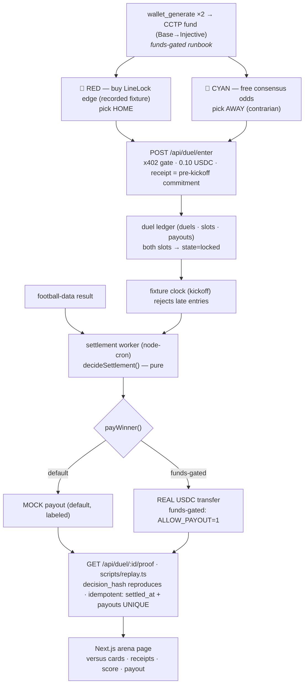

# Architecture — AgentDuel (as built)

> This reflects the **shipped code**. Where it diverges from the spec's
> `../ARCHITECTURE.md`, the code + the shipped `@injectivelabs/x402@0.0.1` types
> win (noted inline).

## Flow

## Modules

| Dir | Responsibility | Key files |
|---|---|---|
| `arena/` | **Pure** domain: slot matching + typed errors, `pick_hash`/`decision_hash`, void/fee math, `decideSettlement`. No IO. | `core.ts`, `hash.ts`, `types.ts` |
| `settle/` | Idempotent settlement worker + the `payWinner` honesty gate (mock ↔ real). | `worker.ts`, `pay.ts` |
| `db/` | SQLite ledger: `duels`, `slots` (UNIQUE(duel,side) + UNIQUE(duel,agent)), `payouts` (UNIQUE(duel,agent) = idempotency spine). Seeder. | `schema.ts`, `ledger.ts`, `seed.ts` |
| `data/` | football-data client = referee for the entry clock (kickoff) AND the result. Snapshot fallback. | `football.ts` |
| `api/` | Express: x402 gate on `POST /api/duel/enter`; free `/api/duel/:id`, `/api/duels`, `/api/duel/:id/proof`, `/api/verify`. | `middleware.ts`, `routes.ts`, `server.ts` |
| `duelists/` | RED (LineLock edge), CYAN (contrarian), the x402 entry client. | `red.ts`, `cyan.ts`, `edge.ts`, `enter.ts` |
| `web/` | One-route Next.js arena page (API fetch + committed snapshot fallback). | `app/page.tsx`, `lib/arena.ts` |
| `scripts/` | `replay` (--render), `settle` (--cron), `bench`, `spawn-duelists`, entry/payout smokes, `readiness`. | |

## The two design decisions that carry the thesis

1. **Idempotency is structural, not hopeful.** The `payouts` table has
   `PRIMARY KEY (duel_id, agent)`; a second settlement leg INSERT collides and is
   rejected. Combined with the duel-level `settled_at` guard, a double-run pays
   once — asserted by tests two ways.

2. **The decision is a pure function.** `decideSettlement(duel, slots, result)`
   has no IO; the worker and `replay.ts` both call it, so the settlement is
   reproducible from the ledger + archived result. `transfer_send` has no memo, so
   this `decision_hash` (in `/proof` + `replay`) is the notarization.

## x402: the real surface (correction to the spec)

`../ARCHITECTURE.md` sketched a flat `injectivePaymentMiddleware({endpoint,
network, asset, amount})`. The shipped `@injectivelabs/x402@0.0.1` middleware is a
**routes map**: `injectivePaymentMiddleware(routes, options)` where `routes` is
keyed `"POST /api/duel/enter"` with `{ description, mimeType, accepts:[{network,
asset, amount, payTo, maxTimeoutSeconds}] }` and `options` carries
`{ facilitator:{privateKey,confirmations}, baseUrl, settlementPolicy }`. The
middleware fills `extra:{name:"USDC",version:"2",assetTransferMethod:"eip3009"}`
into the emitted 402. `api/middleware.ts` uses the real shape.

## Residual risks (documented)
- Both agents same side → impossible (`SIDE_TAKEN` + CYAN's contrarian rule).
- Result-API lag at the whistle → worker `--cron` retries every 5 min; the card
  shows the pending→settled transition.
- Facilitator/wallet unfunded → paid calls return 402 (honest), settlement uses
  the labeled mock; no fake receipts.
